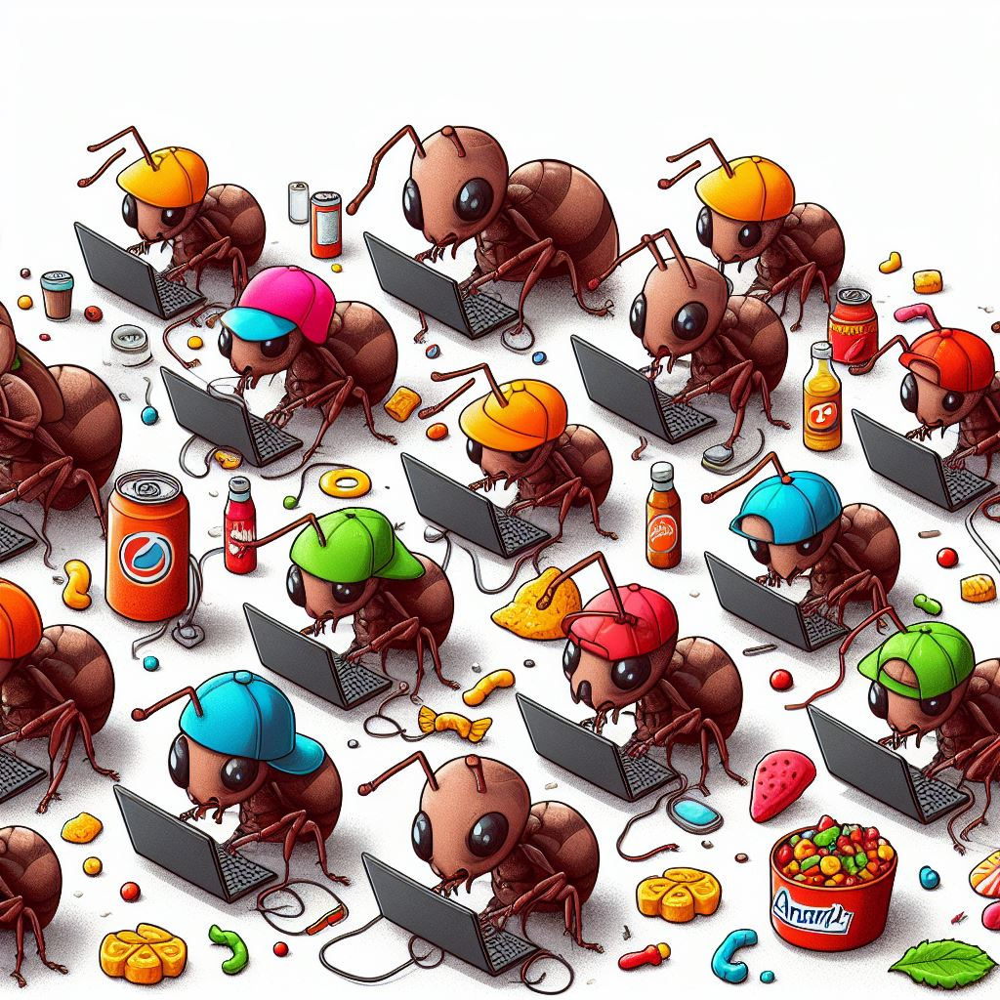
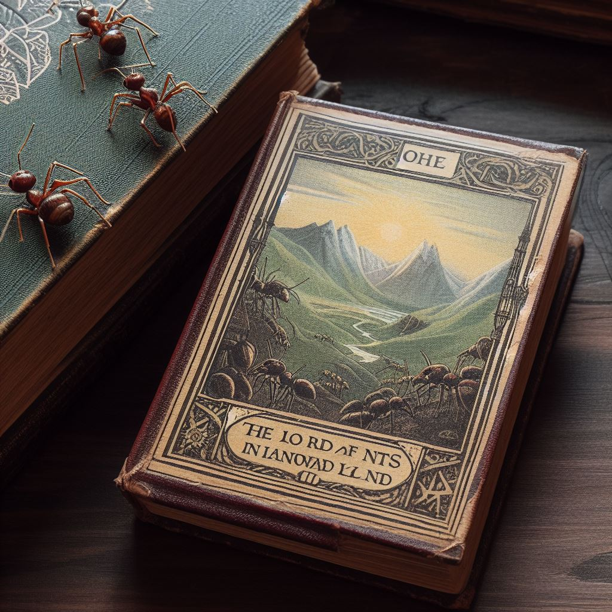
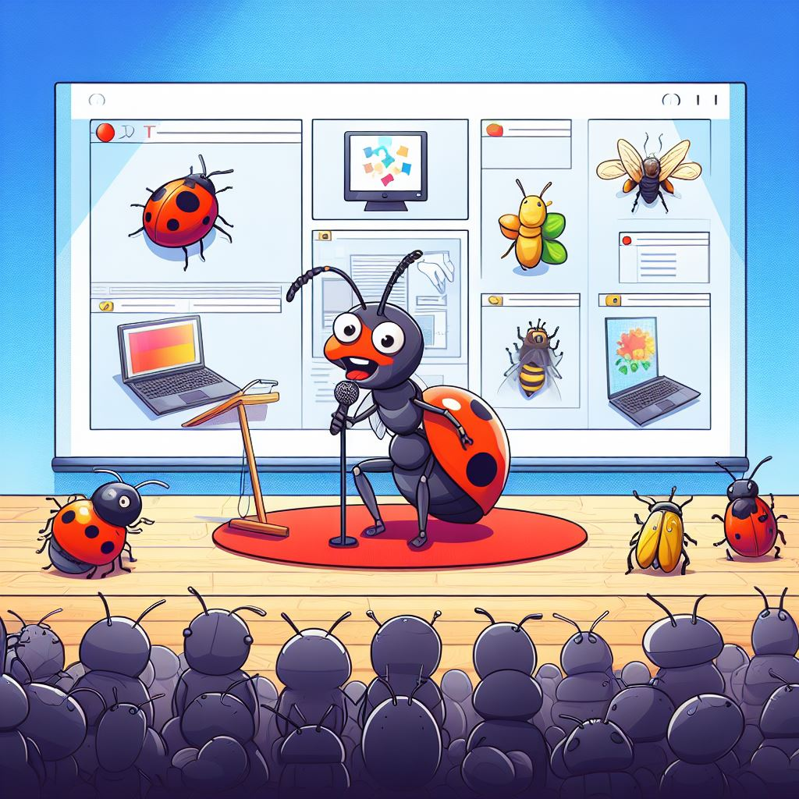
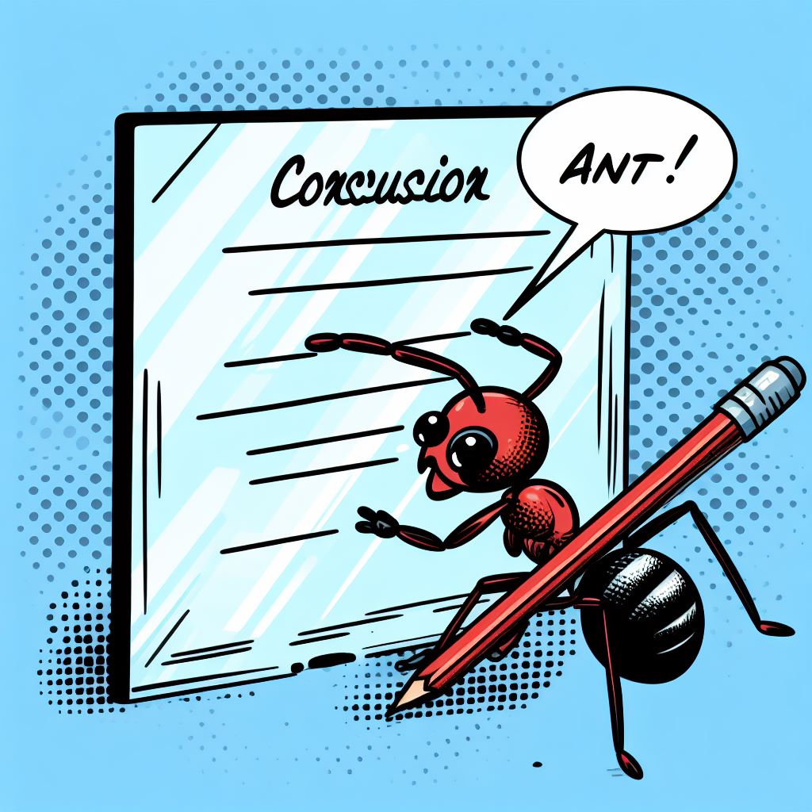
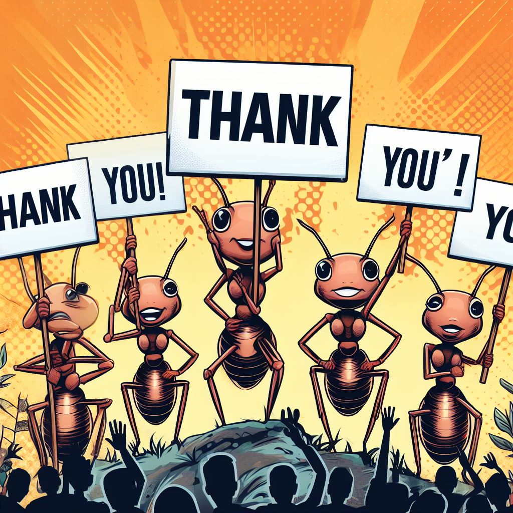

# Fun with ANTA

<!-- Do not add page number on this slide -->
<!--
_paginate: false
-->

<style scoped>section {font-size: 28px;}</style>

```ANTA Hackathon Script```



---

# Introduction

<!-- Add footer starting from this slide -->
<!--
footer: 'Arista EMEA ANTA Hackathon - 2023'
-->


- This hackathon is split into 3 sections. Each section takes around 20 minutes to complete. But it can takes more time if you are running it on your own.
- Work in team, only one submission per team
- Repository is available at [titom73/anta-malaga](https://github.com/titom73/anta-malaga)
- An Arista Test Drive is required.
- Ask questions at any time!
- Google Chat: [#anta-field](https://chat.google.com/room/AAAAN780xDU?cls=7) on Google Chat

---

# Context

Your customer told you their servers can’t reach ressources and they configure servers and fabric with LACP

You don’t have access to configuration of devices and you need to identify his issue.

Test your fabric to check:
- If all BGP sessions are UP and established.
- If all interfaces are UP and do not have error or drop counters.
- EVPN family is configured.



---

# Stage #1

1. Create an ANTA inventory from scratch
2. Create an ANTA test catalog from the test plan
3. Is there any issue on the fabric?

__That’s all folks!__

Use your brain and RTFM:
- [Use Inventory & Catalog](https://www.anta.ninja/v0.10.0/usage-inventory-catalog/)
- [ANTA CLI overview](https://www.anta.ninja/v0.10.0/cli/overview/)
- [Get Inventory Information](https://www.anta.ninja/v0.10.0/cli/get-inventory-information/)
- [ANTA Tests catalog](https://www.anta.ninja/v0.10.0/api/tests/)


---

# Stage #2

Now, you have seen that PortChannel4 is down

Develop a test to check LACP status:

- Check `PortChannel` is in `collecting` mode
- Check `PortChannel` is in `distributing` mode

## Tips

- Use `pip install -e .`
- Develop your tests under `./anta_custom/<your_file>.py`
- Your test will be available with `anta_customer.<your_file>.<your_test>`
- [Test development example](https://github.com/titom73/atd-anta-demo/tree/main/docs)


---

# Stage #3

Traffic is still not passing correctly. Check that all connected routes are correctly installed in routing table. You should have at least 3 connected routes installed in VRF `Tenant_A_OP_Zone`

Develop a test based on `AntaTemplate` to validate number of connected routes in VRFs:

- Test __must__ use [`anta.models.AntaTemplate`](https://www.anta.ninja/v0.10.0/api/models/#template-definition)
- VRF name is an template input for your test.
- Run ANTA to check routes status and fix configuration in EOS.


---

# Stage #4

You can now build additional tests to make your customer happier with his Arista Fabric.

__Stage is yours !__



---

# Conclusion

- How do you think you can use ANTA in the field ?
- What key feature is missing for customer’s usage ?



---

<!-- # Thank you ! -->

<!-- Do not add page number on this slide -->
<!--
_paginate: false
-->

<style scoped>section {font-size: 28px;}</style>


